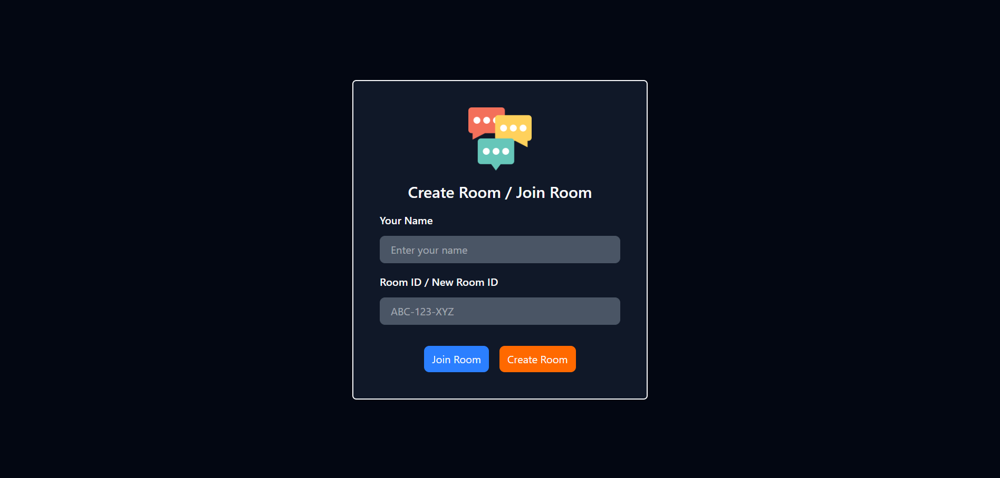
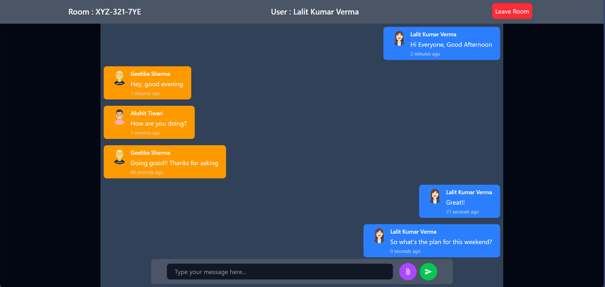

# 💬 ChatApp-frontend

ChatApp Frontend is a **real-time, room-based chat application** where users can **create a room, join an existing room, and share the room code** with others to start chatting instantly.  
The application communicates with the backend using **WebSocket and STOMP** for real-time messaging.

---

## 🚀 Features

- 💬 Real-time messaging using **WebSocket & STOMP**
- 🏠 Room-based chat system
- ➕ Create a chat room instantly
- 🔑 Join rooms using a shared room code
- 🔗 Share room code with others
- 👥 Multiple users can join the same room
- 🎨 Clean & responsive UI built with **Tailwind CSS**

---

## 🛠️ Tech Stack

- **React**
- **WebSocket**
- **STOMP**
- **JavaScript (ES6+)**
- **Tailwind CSS**

---

## 🧩 How It Works

1. User creates a new chat room
2. A unique **room code** is generated
3. User shares the room code with others
4. Other users join the room using the code
5. Messages are exchanged in real-time via **STOMP over WebSocket**

---

## 🔗 Backend Code

This frontend application works with a backend service responsible for **room management and real-time messaging**.

➡️ **Backend Repository:**  
[https://github.com/lalit2506verma/chatapp-backend](https://github.com/lalit2506verma/chatApp-backend)

---

## 🖼️ Application Screenshots

### 🏠 Join / Create Room


### 💬 Chat Room Interface


---

## 📂 Project Structure

```text
src/
 ├── components     # Reusable UI components
 ├── pages          # Screens (Join Room, Chat Room)
 ├── services       # WebSocket / STOMP client setup
 ├── utils          # Helper functions
 ├── styles         # Tailwind styles
 └── App.jsx        # Application entry point
